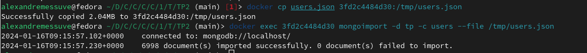
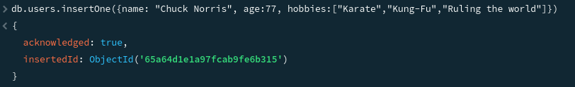
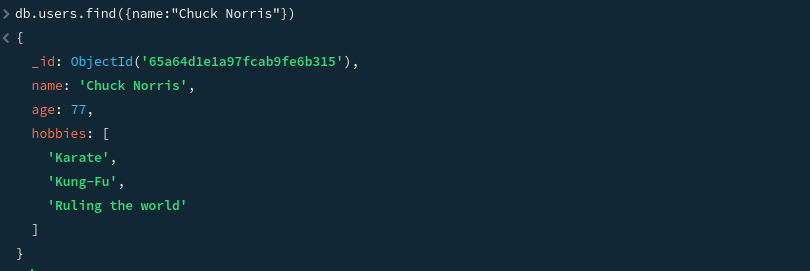
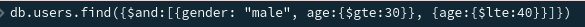
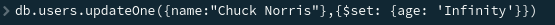

# TP 2

## 01 Create

Importation des données :



Insertion de Chuck Norris dans la bdd:



## 02 Read

Affichage de Chuck Norris:



Affichage de Chuck Norris sans id: 
```bash
db.users.find({name: "Chuck Norris"}, {_id: false})
```

Affichage utilisateur entre 20 et 25 ans:


Affichage homme entre 30 et 40 ans: 



Affichage utilisateur habitant en Louisiane: 


Affichage les 20 premiers utilisateur en ordre décroissant d'age:


Affichage du nombre de femme dont l'age est de 30: 


## 03 Update

Update l'age de Chuck Norris pour mettre Infinity:



Update les utilisateur en enlevant le champs Phone:


Update les utilisateur de plus de 50 ans en ajoutant jardinage dans leur hobbies:

```bash
db.users.updateMany({age: {$gt:50}}, {$push: {hobbies: "jardinage"}})
```