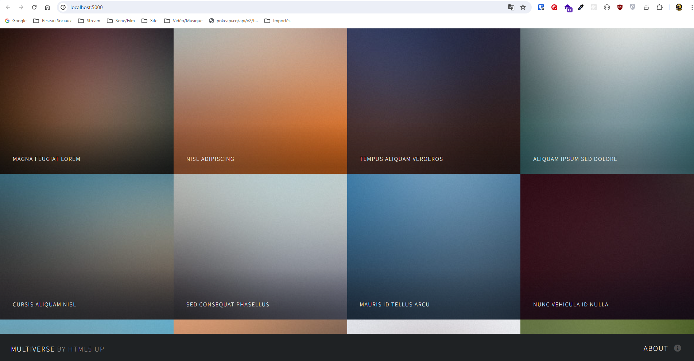
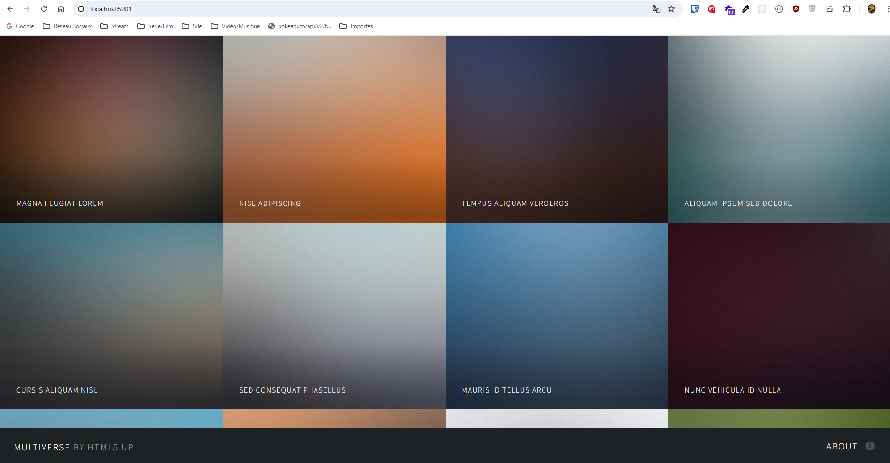

# Exercice 5

- Création d'un volume nommé 

- Création d'un conteneur serveur web avec nginx et utilisation du volume cree pour stocker votre site web.

- confirmation via votre navigateur 

- suppression de votre conteneur nginx

- Création d'un conteneur serveur web avec apache qui utilisera le site web présent dans votre volume.


```bash
docker volume create mon-site-web
docker volume ls

docker run -v mon-site-web:/usr/share/nginx/html/ -p 5000:80 --name nginx-website -d nginx

docker cp .\html5up-multiverse.zip nginx-website:/root

docker exec -it nginx-website bash
apt update
apt upgrade -y
apt install unzip -y

cd /root
ls
unzip html5up-multiverse.zip -d /usr/share/nginx/html/
```

```bash
exit
docker stop nginx-website
docker rm nginx-website

docker run -v mon-site-web:/usr/local/apache2/htdocs -p 5001:80 --name apache-website -d httpd
```

```bash
docker run -v mon-site-web:/usr/share/caddy/ -p 3000:80 --name caddy-website -d caddy
```