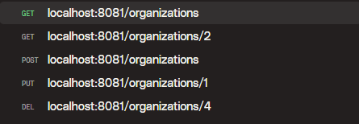
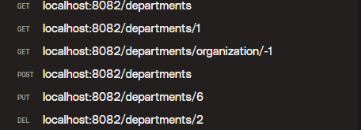
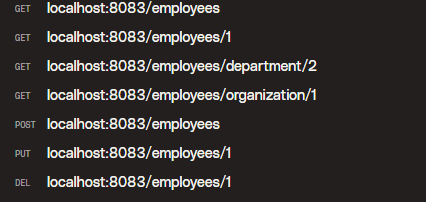

# TP Quarkus Kafka 3

## Running the application

````bash
docker compose up --build -d
````

Wait the build of the application and the kafka cluster.

## Endpoints

### Organization

`````json
{
  "name" : "Organization",
  "address": "Address"
}
`````

### Department


**for get all department with no organizationId use -1 as organizationId
exemple: http://localhost:8082/departments/organization/-1**


`````json
{
  "name" : "Department",
  "organizationId": 1
}
`````


### Employee


**for get all employees with no organizationId or departmentId use -1 as organizationId or departmentId
exemple: http://localhost:8083/employees/department/-1**

`````json
{
  "firstName" : "Jean",
  "lastName": "Dupont",
  "birthDate": "1990-01-01",
  "position": "Developer",
  "departmentId": 1,
  "organizationId": 1
}
`````